# 돈쭐: 사용자 참여형 착한 소비 인증 챌린지 플랫폼

## 🙋‍♂️ 강병진(kang-bjin) - 백엔드/기획/기술 리드
- 아이디어 제안, 서비스 핵심 철학과 방향성 기획, 전체 구조 설계 주도
- 기술적 리더로서 스프링 MVC, 인증, JPA 등 주요 기술 의사결정 및 공유
- 기획 / 설계 / 개발 등 대부분의 Notion 문서 작성 및 관리
- 사용자 인증, 제보-투표-등록-기부 등 백엔드 및 DB 전담 구현
- Flask + Tesseract OCR 기반 영수증 인증 파이프라인 전담 구축
- 영상처리 기술을 이용한 영수증 이미지 전처리 로직 구현
- 팀 내 역할 분배 / 기술 난이도 조율 / 갈등 해결 주도 / 최종 발표 및 질의응답 총괄

<details>
<summary> 전체 기여내용 보기 </summary>

```
<협업>
**기술적 리드**
팀의 전반적인 개발 경험이 부족하여 자연스럽게 기술적 의사결정과 기술 공유, 구조 설계를 도맡게 되었습니다. 기획 단계부터 구현, 작업 분배, 기술적 난이도 조율 등 주요 기술적 의사결정을 주도하였고, 인증, MVC, JPA 등 필수 개념을 반복적으로 설명하며 기술적 방향성을 공유하려 노력했습니다. 일정 / 연동 / 기획 / 디자인 / 프론트엔드 / 백엔드 / DB / DevOps 관련 Notion 문서를 대부분 직접 작성하고 관리하였습니다.

**역할 분배**
백엔드 역할 분배 시 개발 경험과 역량이 부족한 팀원이 있어, 각자의 수준에 맞는 개발 경험을 쌓을 수 있도록 고민했습니다. 스프링 MVC 구조를 직접 설명하고, 간단한 회원가입/로그인 코드를 뜯어보며 백엔드 전체 흐름을 몸으로 익히도록 안내했습니다. 이후 프로젝트 중후반 프론트-백엔드 연동 및 백엔드 배포 역할을 배분해 실질적인 개발 경험과 성취감을 얻을 수 있도록 도왔고, 이 과정을 통해 다양한 배경을 가진 팀원들이 함께 성장할 수 있는 환경을 만들었습니다.

**갈등 해결**
프로젝트 중반, 교수님의 조언을 참고하여 ‘전체 기능보다는 핵심 기능의 완성에 집중하자’는 방향을 제시했습니다. 이 과정에서 일부 팀원과 세부 작업 내용 및 우선순위에 대한 이견이 있었으나, 프로젝트 전체 흐름과 각 기능의 중요성을 객관적인 설명과 자료로 공유하며 소통했습니다. 그 결과 남은 시간 동안 핵심 기능에 집중할 수 있었고, 프로젝트를 완성도 있게 마무리할 수 있었습니다.


<기획>
**아이디어 제안자**
팀원들의 개발 경험을 고려해, 구현 난이도가 적당하면서도 사회적 공감대를 형성할 수 있는 ‘돈쭐’이라는 주제를 제안하였고, 팀 내 만장일치로 선정되었습니다.

**핵심 기획자**
아이디어 제안자로서 서비스의 방향성과 철학, 초기 주요 기능을 구상했습니다. 예를 들어, 회의 중 리더보드·경쟁 시스템 도입 의견이 있었지만 ‘경쟁 기능이 들어가면 착한 소비 확산이라는 본래 철학이 변질될 수 있다’고 제안했고, 팀원들도 동의하여 SNS 공유 등 비경쟁적 확산 요소에 집중할 수 있었습니다.

**구현 방법 설계**
팀 내 유일한 융합SW 전공자로서 각 기능의 구현 난이도를 평가하고, 효율적인 구현 방안을 설계했습니다. 예를 들어 영수증 데이터를 DB에 저장·인증하는 방안을 논의할 때, Hash 함수를 활용해 fixed-length int 정형 데이터로 저장하여 O(1) 시간 내 비교가 가능하도록 제안했고, 채택되었습니다. 이처럼 기능 구현뿐 아니라 성능과 확장성까지 고려해 프로젝트가 원활히 진행되도록 했습니다.


<구현>
**백엔드·DB 전담 구현**
사용자 참여 기반 구조를 설계하고, 제보-투표-등록으로 이어지는 전 과정을 백엔드에서 전담 구현했습니다. 사용자가 제보한 가게는 투표 및 관리자 검증을 거쳐 착한가게로 등록되도록 설계하였고, 이를 위해 제보 상태 관리, 중복 투표 방지 로직, JWT 기반 사용자 인증 등을 직접 구현해 전체 흐름을 완성했습니다. 이외에도 후기 작성, 착한가게 지도, 캐릭터 성장, 기부 등 백엔드 전 기능을 담당하였습니다.

**영상처리 기술을 통한 OCR 구현**
영수증 인증 기능을 위해 Flask 서버에서 Tesseract를 이용해 OCR을 수행하고, 결과 데이터를 Spring 서버로 전송해 처리하도록 구현했습니다. OCR 정확도를 높이기 위해 업스케일링, 그레이스케일 변환, Otsu 이진화, Morphological Opening 등 여러 영상처리 기법을 적용해 이미지 품질을 개선한 뒤 텍스트를 추출했습니다. 추출한 사업자번호 및 날짜 정보를 바탕으로 DB 내 기존 가게와 매칭 여부를 판단하고, 이를 통해 인증된 가게인지 또는 새로운 제보인지를 자동으로 분류할 수 있도록 구현했습니다.


<문서 및 발표>
**최종 발표 및 질의응답 주도**
초기에는 기술 리드 역할에 집중했으나, 프로젝트가 진행될수록 전체 기획 의도와 핵심 구현 흐름을 가장 깊이 이해하고 있는 사람이 직접 설명하는 것이 전달력과 완성도 면에서 바람직하다고 판단했습니다. 팀장의 발표 중 깊이 있는 답변이 필요할 때 보강 설명을 맡았고, 최종 발표에서는 질의응답을 주도하며 단순 기능 소개를 넘어서 서비스 기획 철학, 기술적 설계 배경, 개발 중 이슈 및 해결 방안까지 종합적으로 설명했습니다.

**핵심 아이디어 작성자**
아이디어 제안자로서 기획의 중심이 되는 대안 도출과 구현 계획을 작성했습니다. 영수증 OCR 인증 로직, 기부 시스템, 가게 제보-투표-등록 로직, 재난 지역 점수 2배 시스템, 소비 인증 및 SNS 공유 기능 등 서비스 핵심 기능을 구체화하였고, 유스케이스 다이어그램, ERD, 시스템 아키텍처 등 필수적이지만 난이도 높은 설계 문서를 맡아 작성했습니다. 보고서는 영구히 남는 산출물인 만큼, 맡은 부분 외에도 처음부터 끝까지 전체 내용을 여러 번 교정하며 완성도를 높였습니다.
```

</details>

## 25-1 오픈소스소프트웨어프로젝트 2조 Spring

 

## 💡프로젝트 개요
- ‘돈쭐’은 사용자 참여를 기반으로 한 착한 소비 인증 플랫폼 웹서비스로, 선한 영향력을 가진 ‘착한 가게’들을 발굴하고 응원하는 데 초점을 맞춘다. 이 플랫폼은 사용자가 직접 방문한 가게의 영수증을 인증함으로써 선행 소비를 기록하게 하며, 이를 통해 포인트를 적립하고 다양한 방식으로 사회적 가치에 기여할 수 있도록 설계되었다.

- 사용자는 인증을 통해 모은 포인트로 기부 활동에 참여하거나, 캐릭터 성장과 같은 게임 요소를 경험할 수 있어, 착한 소비가 단순한 실천을 넘어 재미있는 놀이처럼 반복되는 행동이 되도록 유도한다. 또한, 인증된 착한 소비 정보는 지도 기반으로 시각화하여 지역 사회의 착한 가게를 한눈에 확인할 수 있고, 이를 SNS에 공유함으로써 자발적인 확산과 참여를 이끌어낸다.

- ‘돈쭐’은 인증, 공유, 참여, 기부의 선순환 구조를 통해 착한 소비 문화를 일상 속에 자연스럽게 녹여내고자 한다. 궁극적으로는 조용히 선행을 실천하는 작은 가게들이 사회적으로 주목받고 지속적으로 응원받는 구조를 만들며, 개인의 소비가 사회를 바꾸는 힘이 되는 경험을 제공하는 것이 이 프로젝트의 핵심 목표이다.

| 메인 화면 | 착한 가게 탭 | 커뮤니티 탭 |
|--------|--------|--------|
|  | 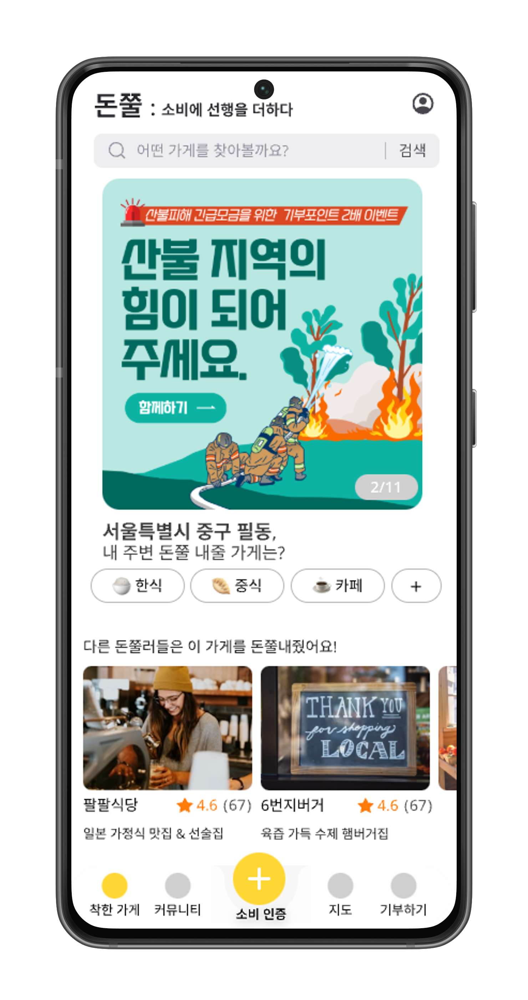 | 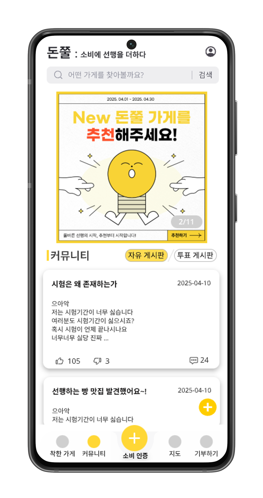 |
| 소비 인증 탭 | 지도 탭 | 기부 탭 |
| 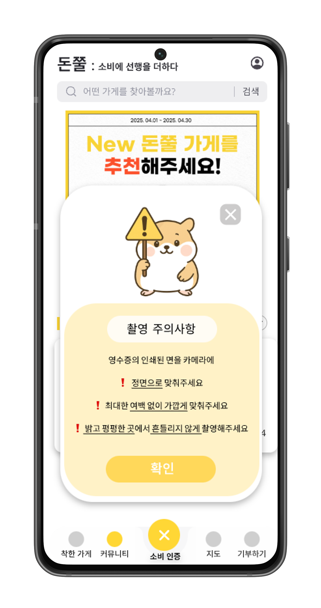  | 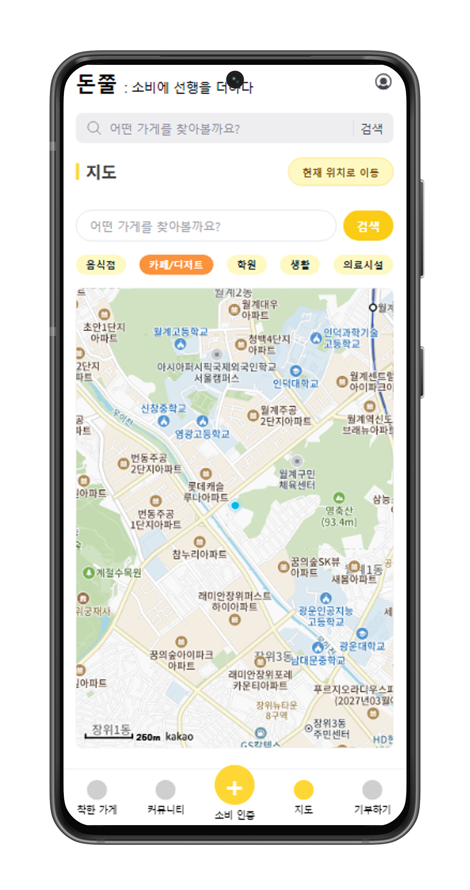   | 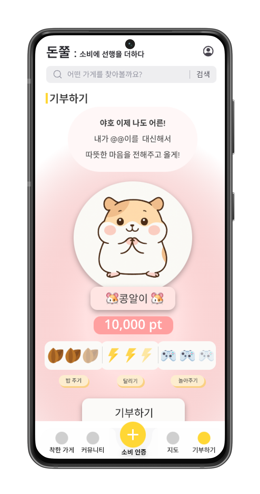   |


## 🔗 배포 링크
(https://donzzul.netlify.app/)


## 💫 팀원 소개

| 서희정 (팀장)       | 이설후 | 강병진     | 김시연 |
|----------------|--------|---------|--------|
| 디자인, 프론트엔드, 배포 | 프론트엔드 | 기획, 백엔드 | 연동, 배포 |
| 경제학과           | 산업시스템공학과 | 전자전기공학부 | 산업시스템공학과  |


## 💻 개발 기간
2025.03.02 ~ 2025.06.11


## 📸 시연 영상
(https://youtube.com/watch?v=aEeJ8gx_cPI&feature=shared)

## 👐 개발 동기
개발 동기 내용에 맞게끔 줄여줘 ‘돈쭐내다’는 ‘돈’과 ‘혼쭐내다’의 합성어로, 2021년을 전후해 대중적인 관심을 받기 시작한 신조어다. 이 표현은 선행을 실천한 자영업자에게 고의적으로 주문을 몰아주어 매출을 올려주는 행위를 의미하며, 단순한 응원이 아닌 실질적인 소비로 보답하는 형태의 격려이다. 즉, ‘돈을 벌게 해주는 것’과 ‘혼쭐날 만큼 바쁘게 만들어주는 것’이라는 두 가지 의미가 결합된 개념으로, 자영업자들의 선한 영향력에 대한 대중의 긍정적 반응을 상징한다.
이러한 ‘돈쭐’ 문화는 사회 구성원들이 자발적으로 착한 가게를 응원하고 소비를 통해 행동하는 문화를 보여주는 좋은 예시였다.

그러나 이런 문화는 일회성 이슈나 바이럴에 그치는 경우가 많고, 꾸준한 참여나 장기적인 확산으로 이어지기 어려운 구조라는 한계가 있었다.
본 프로젝트는 이 지점에서 출발했다. 세상에는 조용히 선행을 실천하는 수많은 가게들이 존재하지만, 이들의 이야기가 제대로 조명되지 않거나 지속적으로 응원받을 수 있는 시스템이 부족하다. 반면 그러한 선행을 응원하고 싶은 시민들은 많고, 이들의 참여 의지를 이끌어낼 수 있는 창구가 필요하다고 보았다.


## 🏁 개발 목표
본 프로젝트의 목표는 ‘착한 소비’를 일상 속에서 자연스럽게 유도하고 확산시킬 수 있는 사용자 참여형 플랫폼 ‘돈쭐’을 개발하는 것이다. 세부 목표는 사용자 인터페이스 향상, 기술적 구현 그리고 사회적 가치 실현이다. 돈쭐은 단순한 착한 소비 인증을 넘어, 커뮤니티 기반의 선행 공유, 캐릭터 육성 등 게이미피케이션 요소를 접목한 기부 연계 시스템을 통해 소비의 선순환 구조를 재미있고 부담 없이 지속 가능 하도록 설계하고자 한다.

(1) 사용자 인터페이스(UI)
    - 착한 소비 과정을 쉽고 직관적으로 인증할 수 있는 UI/UX 설계
    - 사용자 간 소통과 확산을 위한 댓글, 공유, 여론 피드백 기능 제공
    - 소비 인증 활동에 재미를 더하는 캐릭터 육성 및 게이미피케이션 요소 도입
    - 반복적 참여를 유도하는 포인트, 커뮤니티 기반의 동기부여 시스템 설계

(2) 기술적 구현
    - 영수증 이미지 기반의 소비 인증 자동화 기능 개발 (OCR 또는 QR 기반)
    - 위치 기반 필터 및 상세정보 제공이 가능한 지도 기반 가게 탐색 시스템 구현
    - 향후 실제 서비스 운영을 고려한 모듈화 및 유연한 구조의 확장 가능한 설계

(3) 사회적 가치 실현
    - 지역 기반의 착한 가게 정보 축적 및 지속적 업데이트
    - 착한 소비에 대한 사회적 인식 확산 유도
    - 소비와 기부를 연결하여 개인의 소비 활동을 사회적 기여로 전환하는 구조 마련
    - 선한 영향력 사례의 발굴과 공유를 통한 자발적 참여 문화 조성


## 🌟 최종 구현 결과
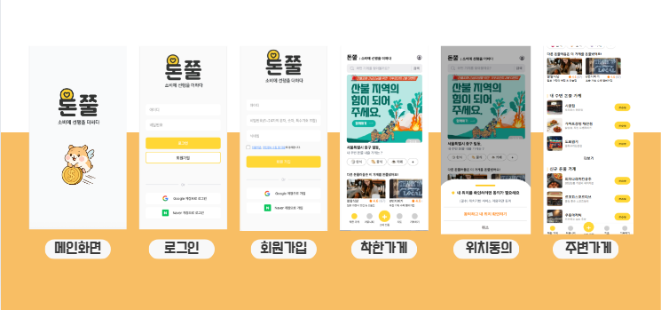 
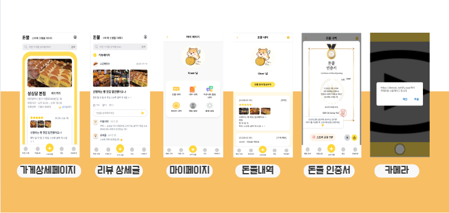 
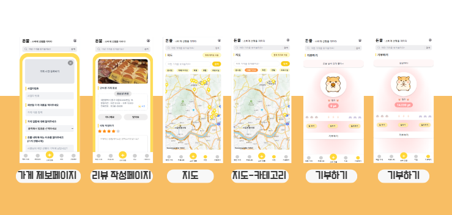 
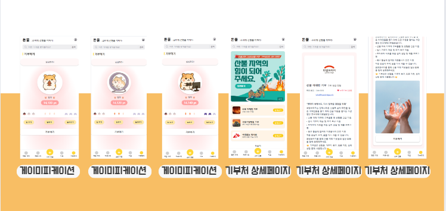 
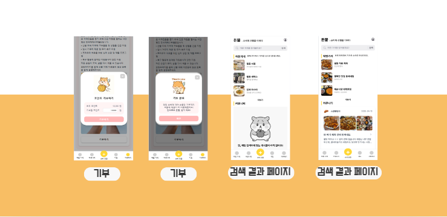 

## 🧾 다이어그램
### 시스템 아키텍처
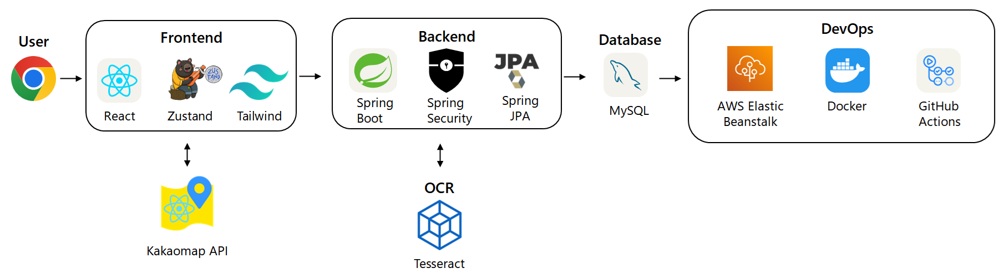 

### 개념 설계도
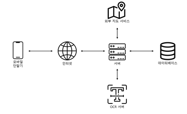 

### 시스템 블록 다이어그램
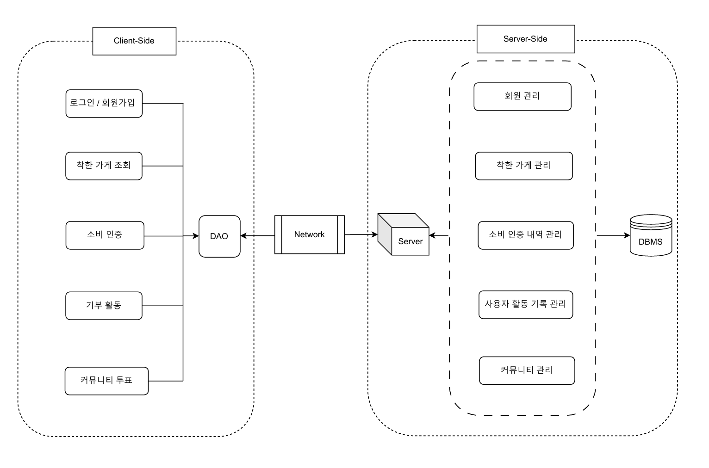 

### 플로우 차트
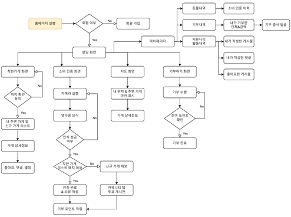 

### 시퀀스 다이어그램
| 소비인증 | 착한 가게 제보 | 기부 |
|--------|--------|--------|
| 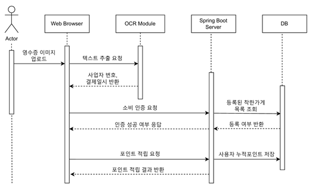  | 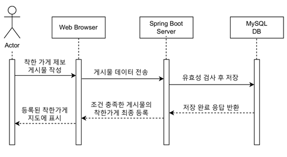 | 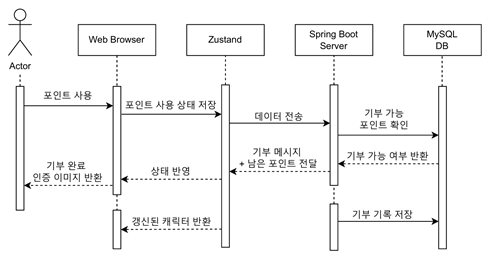  |

### ERD
 

## 📂 프로젝트 구조

```
📦 2025-1-OSSProj-Spring-02
 ┣ 📂 db/                    # DB
 ┣ 📂 doc/                   # 문서
 ┣ 📂 images/                # 이미지 파일
 ┣ 📂 src/                   # 핵심 소스 코드
 ┃ ┣ 📂 backend/             # 백엔드 코드
 ┃ ┣ 📂 frontend/            # 프론트엔드 코드
 ┃ ┃ ┣ 📂 src/
 ┃ ┃ ┃ ┣ 📂 app/             # 페이지 코드
 ┃ ┃ ┃ ┣ 📂 components/      # UI 컴포넌트
 ┃ ┃ ┃ ┗ 📂 store/           # Zustand 상태관리
 ┃ ┃ ┗ 📂 ocr-server/        # 오픈소스 OCR 서버
```

<details>
<summary>📦 backend </summary>

```
📦 backend
┣ 📂gradle
┃ ┗ 📂wrapper
┣ 📂src
┃ ┣ 📂main
┃ ┃ ┣ 📂java
┃ ┃ ┃ ┗ 📂com
┃ ┃ ┃ ┃ ┗ 📂ossproj
┃ ┃ ┃ ┃ ┃ ┗ 📂donjjul
┃ ┃ ┃ ┃ ┃ ┃ ┣ 📂config
┃ ┃ ┃ ┃ ┃ ┃ ┣ 📂controller
┃ ┃ ┃ ┃ ┃ ┃ ┣ 📂domain
┃ ┃ ┃ ┃ ┃ ┃ ┣ 📂dto
┃ ┃ ┃ ┃ ┃ ┃ ┣ 📂enums
┃ ┃ ┃ ┃ ┃ ┃ ┣ 📂repository
┃ ┃ ┃ ┃ ┃ ┃ ┣ 📂security
┃ ┃ ┃ ┃ ┃ ┃ ┣ 📂service
┃ ┃ ┃ ┃ ┃ ┃ ┗ 📂util
┃ ┃ ┗ 📂resources
┃ ┃ ┃ ┣ 📂static
┃ ┃ ┃ ┃ ┗ 📂images
┃ ┃ ┃ ┣ 📜application.yml
┃ ┃ ┃ ┣ 📜application-dev.yml
┃ ┃ ┃ ┗ 📜application-docker.yml
┣ 📂test
┃ ┗ 📂java
┃ ┗ 📂com
┃ ┗ 📂ossproj
┃ ┗ 📂donjjul
┣ 📜.gitattributes
┣ 📜.gitignore
┣ 📜build.gradle
┣ 📜gradlew
┣ 📜gradlew.bat
┣ 📜query
┗ 📜settings.gradle
```
</details>

<details>
<summary>📦 ocr-server </summary>

```
📦 ocr-server
┣ 📂 test
┣ 📂 test_data
┣ 📜 .dockerignore
┣ 📜 app.py
┣ 📜 Dockerfile
┣ 📜 ocr_module.py
┗ 📜 requirements.txt
```

</details>


## ♥️ 기대효과 
1. 비즈니스 측면
  착한 소비를 데이터화하고 사용자 참여를 유도하는 구조는 사회적 가치를 실현하는 가게들에게 실질적인 비즈니스 이점을 제공한다. 소비자의 인증과 공유를 통해 착한 가게는 자연스럽게 홍보 효과를 얻고, 신뢰 기반의 브랜드 이미지를 형성할 수 있다. 또한 가게의 사회적 영향력을 통해 ESG 기반의 브랜딩이나 기업 협업과 같은 새로운 비즈니스 기회를 창출할 수 있다.

2. 사회적 측면
  ‘돈쭐’은 선행을 실천하는 가게를 조명하고, 착한 소비를 유도함으로써 선한 영향력이 일상에 스며드는 문화를 형성한다. 단순한 소비를 넘어서 타인의 선행에 공감하고 함께 응원하는 구조는 사회적 연대감을 높이며, 지역 사회 내 정서적 유대 형성과 공동체 의식 확산에도 기여할 수 있다. 개인의 작지만 반복적인 행동이 사회 전체의 긍정적 흐름으로 이어지는 구조를 지향한다는 점에서, 사회적 가치 실현의 가능성이 크다.

3. 경제적 측면
   플랫폼을 통해 소비 흐름이 기존 대형 플랫폼 중심에서 지역의 소상공인으로 분산되면서, 지역 상권에 실질적인 활력을 불어넣을 수 있다. 특히 착한 가게들이 밀집된 지역은 플랫폼 상에서 더 높은 노출과 방문율을 기대할 수 있으며, 이는 자연스럽게 지역 경제 활성화로 이어진다. 반복적인 소비를 유도하는 리워드 구조와 기부 연계 시스템은 개인의 소비를 지속 가능하게 만들고, 전반적인 소비 활동의 질적 전환을 이끌어낸다.

4. 기술적 측면
  ‘돈쭐’은 기술을 통해 사회 문제를 해결하고 가치를 전달하는 플랫폼 사례이다. OCR 기반의 자동 소비 인증, 위치 정보와 연계된 가게 탐색, 사용자 기여도 분석 등은 기술적 응용의 다양성과 정교함을 보여준다. 또한 오픈소스 기반으로 설계되어 협업과 확장이 용이하며, 향후 데이터 기반의 공공 협력이나 기업 연계 서비스로도 발전 가능성이 있다.

## 🔧 기술 스택
| **분야**      | **기술 스택** |
|---------------|-------------------------------------------------------------------------------------------------------------------------------------------------------------------------------------------------------------------------------------------------------------------------------------------------------------------------------------------------------------------------------------------------------------------------------------------------------------------------------------------------------------------|
| **Frontend**  |        |
| **Backend**   |   |
| **Database**  |  |
| **DevOps**    |  |
| **Open Source**  |   || **tools**  |     |

## 📋 자료
- 회의록  
  - [회의록](./doc/회의록/)

- 보고서  
  - [수행계획서](./doc/1_1_OSSProj_02_Spring_수행계획서.pdf)
  - [수행계획서수정본](./doc/(0430)1_1_OSSProj_02_Spring_수행계획서.pdf)
  - [중간보고서](./doc/2_1_OSSProj_02_Spring_중간보고서.pdf)
  - [최종보고서](./doc/3_1_OSSProj_02_Spring_최종보고서.pdf)

- 발표자료  
  - [수행 계획서 발표](./doc/제안발표/1_2_OSSProj_02_Spring_수행계획발표자료.pdf) 
  - [중간 발표](./doc/중간발표/2_2_OSSProj_02_Spring_중간발표자료.pdf)
  - [최종 발표](./doc/최종발표/3_2_OSSProj_02_Spring_최종발표자료.pdf)


- 트러블슈팅
  - [트러블슈팅](./doc/트러블슈팅/OSSProj_트러블슈팅.pdf)

- 소스 코드
  - [src 폴더](./src)

## 📦 사용한 오픈소스 및 라이선스
- [Tesseract OCR](https://github.com/tesseract-ocr/tesseract) - Apache License 2.0- 
- [React](https://react.dev/) - MIT License  
- [Zustand](https://github.com/pmndrs/zustand) - MIT License
- [Framer Motion](https://github.com/framer/motion) – MIT License  
- [Tailwind CSS](https://tailwindcss.com/) - MIT License
- [TypeScript](https://www.typescriptlang.org/) – Apache License 2.0  
- [Spring Boot](https://spring.io/projects/spring-boot) - Apache License 2.0  
- [MySQL](https://www.mysql.com/) - GPL License  
- [Docker](https://www.docker.com/) - Apache License 2.0
