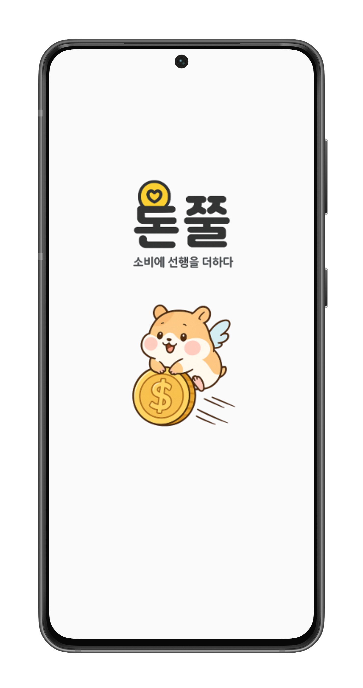

# 돈쭐: 사용자 참여형 착한 소비 인증 챌린지 플랫폼

25-1 오픈소스소프트웨어프로젝트 Spring팀

## 프로젝트 개요
- ‘돈쭐’은 사용자 참여를 기반으로 한 착한 소비 인증 플랫폼으로, 선한 영향력을 가진 ‘착한 가게’들을 발굴하고 응원하는 데 초점을 맞춘다. 이 플랫폼은 사용자가 직접 방문한 가게의 영수증을 인증함으로써 선행 소비를 기록하게 하며, 이를 통해 포인트를 적립하고 다양한 방식으로 사회적 가치에 기여할 수 있도록 설계되었다.

- 사용자는 인증을 통해 모은 포인트로 기부 활동에 참여하거나, 캐릭터 성장과 같은 게임 요소를 경험할 수 있어, 착한 소비가 단순한 실천을 넘어 재미있는 놀이처럼 반복되는 행동이 되도록 유도한다. 또한, 인증된 착한 소비 정보는 지도 기반으로 시각화하여 지역 사회의 착한 가게를 한눈에 확인할 수 있고, 이를 SNS에 공유함으로써 자발적인 확산과 참여를 이끌어낸다.

- ‘돈쭐’은 인증, 공유, 참여, 기부의 선순환 구조를 통해 착한 소비 문화를 일상 속에 자연스럽게 녹여내고자 한다. 궁극적으로는 조용히 선행을 실천하는 작은 가게들이 사회적으로 주목받고 지속적으로 응원받는 구조를 만들며, 개인의 소비가 사회를 바꾸는 힘이 되는 경험을 제공하는 것이 이 프로젝트의 핵심 목표이다.

|  |  |

## 🏃 팀원 소개

| 서희정 | 이설후 | 강병진 | 김시연 |
|--------|--------|--------|--------|
| 팀장  UI/UX 디자인 | 프론트엔드 | 백엔드 | 백엔드 |

## 📁 자료

- 회의록  
  - [회의록](./doc/회의록/)

- 보고서  
  - [수행계획서](./doc/[OSSP-1]%20오픈소스프로젝트%20수행계획서%20(1).pdf수행계획서.pdf)  

- 발표자료  
  - [수행 계획서 발표](./수행계획서_발표.pptx)  
